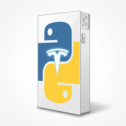

# hacs-pypowerwall



[](https://github.com/jackrayner/hacs-pypowerwall/releases)

A [HACS](https://hacs.xyz/) custom integration for Home Assistant that connects to a Tesla Powerwall gateway using [pypowerwall](https://github.com/jasonacox/pypowerwall). No MQTT broker required — Home Assistant polls the gateway (or Tesla's cloud) directly and exposes battery, grid, solar, and home power as native entities. Supports every connection mode pypowerwall offers: local TEDAPI, customer login, hybrid, cloud, FleetAPI, and TEDAPI v1r LAN.

## Installation

### Via HACS

1. HACS → Integrations → ⋮ → Custom repositories → add this repo URL, category "Integration".
2. Install "Tesla Powerwall (pypowerwall)" and restart Home Assistant.

### Manual

Copy `custom_components/pypowerwall/` into your Home Assistant `config/custom_components/` directory and restart.

## Setup

Settings → Devices & Services → Add Integration → "Tesla Powerwall (pypowerwall)" → pick a connection type.

Poll interval defaults to 5s and is configurable afterward via the integration's Options, regardless of connection type.

### Connection types

| Type | What it needs | Setup |
| --- | --- | --- |
| **TEDAPI** (recommended) | Gateway host + the Wi-Fi password from the gateway's QR sticker | Nothing else — works out of the box on Powerwall 2, Powerwall+, and Powerwall 3. |
| **Hybrid** | The above, plus a Customer Login email/password | Adds supplemental vitals on top of TEDAPI. Requires Customer Login enabled on the gateway. |
| **Local login** | Gateway host + Customer Login email/password | Requires [Customer Login](https://www.tesla.com/support/energy/powerwall/mobile-app/monitoring-from-home-network) enabled on the gateway first (Tesla app or gateway web UI). |
| **Cloud mode** | A directory containing a `.pypowerwall.auth` file | One-time setup *outside* Home Assistant: run `python -m pypowerwall setup` (or `setup -headless` if you can't open a browser on the machine) to log into your Tesla account and create that file, then point the integration at its directory. |
| **FleetAPI** | A directory containing a `.pypowerwall.fleetapi` file | One-time setup outside Home Assistant: register an app at [developer.tesla.com](https://developer.tesla.com), then run `python -m pypowerwall.fleetapi setup` to complete the OAuth flow and create that file. |
| **TEDAPI v1r LAN** | Gateway host + gateway password + an RSA private key path | One-time setup outside Home Assistant: run `python -m pypowerwall register` to generate and register an RSA-4096 key pair with the gateway (may require briefly power-cycling it to confirm), then point the integration at the resulting `.pem`. Powerwall 3 only. |

The three file-based modes (Cloud, FleetAPI, TEDAPI v1r) authenticate via an artifact pypowerwall's own CLI setup tools produce — Tesla's login flow needs a real browser (or a token you paste in headlessly), so there's no way to complete it from a single Home Assistant form. Run the relevant `setup`/`register` command once, on any machine, then tell the integration where the resulting file lives (it just needs to be readable from wherever Home Assistant runs).

## Entities

| Entity | Platform | Notes |
| --- | --- | --- |
| Battery level | sensor | `%`, from customer API scale |
| Battery level (Tesla app) | sensor | `%`, app-scaled value |
| Battery reserve | number | `%`, 0-100, writable — sets the backup reserve |
| Battery mode | select | `self_consumption` / `backup` / `autonomous`, writable — sets the operation mode |
| Grid charging | switch | writable — allow/disallow charging the battery from the grid. **Cloud/FleetAPI mode only.** |
| Grid export | select | `battery_ok` / `pv_only` / `never`, writable — sets the grid export policy. **Cloud/FleetAPI mode only.** |
| Backup time remaining | sensor | hours |
| Grid power | sensor | W |
| Solar power | sensor | W |
| Battery power | sensor | W |
| Battery energy charged | sensor | kWh, cumulative, `total_increasing` — the gateway's own lifetime battery-meter counter, not a client-side estimate. Use for the Energy dashboard's "energy going into the battery." |
| Battery energy discharged | sensor | kWh, cumulative, `total_increasing`, same source. Use for the Energy dashboard's "energy coming out of the battery." |
| Home power | sensor | W |
| Grid status | sensor | `UP` / `DOWN` / `SYNCING` |
| Grid connected | binary_sensor | connectivity, derived from grid status |
| Active alerts | sensor | count of active alerts |
| Firmware version | sensor | diagnostic |
| Uptime | sensor | diagnostic, seconds |
| `<device>` temperature | sensor | one per battery pack reported by `vitals()`, added dynamically |
| Reconnect to grid | button | physically closes the grid contactor, reconnecting the home to the utility grid |
| Disconnect from grid | button | **⚠️ Disabled by default.** See callout below before enabling. |

### Energy dashboard

To add the battery to Home Assistant's Energy dashboard, go to Settings → Dashboards → Energy → Battery → Add battery, and pick "Battery energy charged" for "Energy going into the battery" and "Battery energy discharged" for "Energy coming out of the battery".

**⚠️ "Disconnect from grid" physically opens the Powerwall's grid contactor.** Pressing it islands the home from the utility grid: solar keeps producing and the battery serves home load, but there's a real-world ~30 second solar production dropout while the contactor switches over, and the home stays off-grid until "Reconnect to grid" is pressed (or the gateway is otherwise commanded to reconnect). Because a button press is irreversible-in-the-moment and affects the physical grid connection, this entity ships **disabled** — it will not appear as an active entity until you explicitly enable it via its entity settings (Settings → Devices & Services → Entities → find it → enable). Note that as of pypowerwall 0.16.1 this method isn't yet implemented by any backend (local/TEDAPI/hybrid/cloud/FleetAPI) and currently no-ops with a logged error regardless of connection mode; the entity is included as forward-compatible surface for whenever a backend adds support, and is intentionally not gated by connection type since none is currently known to work.

Two more write actions are exposed as [Home Assistant actions/services](https://www.home-assistant.io/docs/scripts/service-calls/) rather than entities, since they're momentary rather than persistent state, and only available in **TEDAPI v1r LAN mode**:

| Service | Fields | Notes |
| --- | --- | --- |
| `pypowerwall.schedule_max_backup` | `duration_seconds` (optional, default `7200`) | Starts a manual backup event (storm watch / max backup mode) for the given duration. |
| `pypowerwall.cancel_max_backup` | none | Cancels the current manual backup event. |

## Development

See [`CONTRIBUTING.md`](./CONTRIBUTING.md) for a fuller walkthrough of the dev setup, test architecture, and commit/PR conventions.

```bash
python3 -m venv .venv
source .venv/bin/activate
pip install -r requirements-dev.txt

python3 -m pytest
```

`requirements-dev.txt` adds `pytest` and `pytest-homeassistant-custom-component` (a full Home Assistant core install used only for testing) on top of `requirements.txt`.

### Releases

Versions are cut automatically by [release-please](https://github.com/googleapis/release-please) from [Conventional Commits](https://www.conventionalcommits.org/) on `main` (`feat:` → minor, `fix:` → patch, `feat!:`/`BREAKING CHANGE:` → major). It keeps a running release PR up to date with the changelog and version bump; merging that PR tags the release and updates `manifest.json` automatically. Commits that don't follow the convention don't trigger a release.

## Project structure

```
custom_components/pypowerwall/
├── manifest.json         # HA integration metadata, pypowerwall dependency
├── const.py
├── config_flow.py        # connection-type menu + one form per mode, and options (scan interval)
├── coordinator.py         # DataUpdateCoordinator polling pypowerwall.Powerwall; builds Powerwall() kwargs per mode
├── entity.py               # shared device_info base entity
├── sensor.py
├── binary_sensor.py
├── number.py               # battery reserve control
├── select.py                # battery mode control, grid export control (Cloud/FleetAPI only)
├── switch.py                # grid charging control (Cloud/FleetAPI only)
├── button.py                # go off-grid / reconnect to grid (disconnect button disabled by default)
├── services.yaml            # schema for schedule_max_backup / cancel_max_backup (v1r LAN mode only)
├── brand/                 # icon.png / icon@2x.png (HA 2026.3+ reads this directly, no brands-repo PR needed)
├── strings.json / translations/en.json
hacs.json
tests/
├── conftest.py            # make_fake_pw() stub + enable_custom_integrations fixture
├── test_coordinator.py    # pure unit tests: pypowerwall -> PowerwallData mapping, per-mode kwargs building
├── test_config_flow.py    # menu navigation + one success test per connection type
├── test_controls.py       # write-action entities/services driven through real HA service calls
└── test_setup.py          # full entry setup/unload against a stubbed Powerwall client
```
